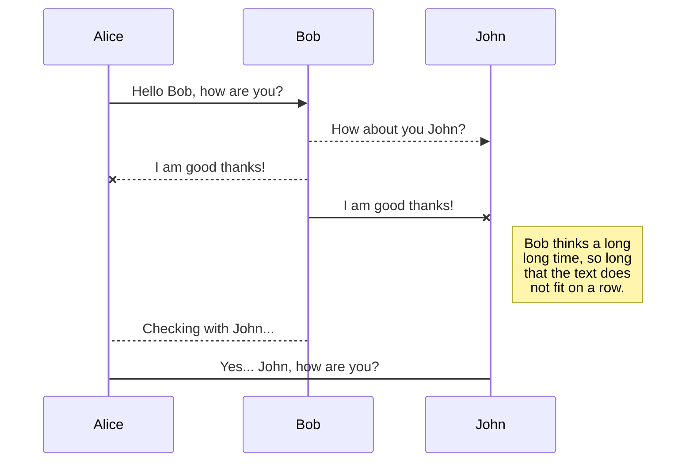

# Guía rápida de Markdown

Esta página es una **chuleta de referencia** para escribir y editar los apuntes de DWEC.

Aquí encontrarás los caracteres y estructuras de Markdown que utilizaremos habitualmente, además de una explicación de los **ejemplos de código interactivos** que tenemos disponibles en estos apuntes.

---

## 1. Títulos

Los títulos se crean utilizando `#`.

```markdown
# Título principal

## Título de segundo nivel

### Título de tercer nivel

#### Título de cuarto nivel
```

El número de `#` determina el nivel:

| Markdown | Resultado |
|---|---|
| `# Título` | Título 1 |
| `## Título` | Título 2 |
| `### Título` | Título 3 |
| `#### Título` | Título 4 |

### Consejo

Utiliza una estructura jerárquica:

```text
# Tema

## Apartado

### Subapartado

### Otro subapartado

## Otro apartado
```

---

## 2. Texto

### Negrita

```markdown
**Texto en negrita**
```

Resultado:

**Texto en negrita**

### Cursiva

```markdown
*Texto en cursiva*
```

Resultado:

*Texto en cursiva*

También se puede utilizar:

```markdown
_Texto en cursiva_
```

### Negrita y cursiva

```markdown
***Texto en negrita y cursiva***
```

Resultado:

***Texto en negrita y cursiva***

### Tachado

```markdown
~~Texto tachado~~
```

Resultado:

~~Texto tachado~~

---

## 3. Código en línea

Para escribir una pequeña parte de código dentro de un párrafo utilizamos una sola comilla invertida:

```markdown
La función `console.log()` permite mostrar información.
```

Resultado:

La función `console.log()` permite mostrar información.

### Importante

La comilla utilizada es:

```text
`
```

y no:

```text
'
```

---

## 4. Bloques de código

Para mostrar varias líneas de código utilizamos tres comillas invertidas:

````markdown
```javascript
const nombre = "Juan";

console.log(nombre);
```

Lista sin ordenar

Se utiliza -:

- HTML
- CSS
- JavaScript
- DOM

Lista numerada
1. HTML
2. CSS
3. JavaScript
4. DOM

Podemos introducir espacios para crear niveles:

- HTML
    - Elementos
    - Atributos
- CSS
    - Selectores
    - Propiedades
- JavaScript
    - Variables
    - Funciones


6. Enlaces

Un enlace se escribe así:

[Texto del enlace](https://www.example.com)

Por ejemplo:

[MDN Web Docs](https://developer.mozilla.org/)


7. Imágenes

La sintaxis básica es:


8. Citas

Utilizamos >:

> Esto es una cita.


9. Separadores

Para crear una línea horizontal podemos utilizar:

---


10. Tablas

Las tablas utilizan | para separar columnas.

| Lenguaje | Uso |
|---|---|
| HTML | Estructura |
| CSS | Presentación |
| JavaScript | Comportamiento |


11. Saltos de línea

Normalmente Markdown interpreta varias líneas como un mismo párrafo.

Si queremos forzar un salto de línea podemos dejar dos espacios al final de la línea:

Primera línea.  
Segunda línea.


12. Admonitions

Material for MkDocs permite crear bloques especiales de información.

La estructura es:

!!! tipo "Título"

    Contenido del bloque.


Consejo
!!! tip "Consejo"

    Recuerda que JavaScript distingue entre mayúsculas y minúsculas.


Información
!!! note "Información"

    Este contenido es importante para comprender el apartado.

Importante
!!! warning "Importante"

    No confundas una variable con su valor.

Peligro
!!! danger "Cuidado"

    Esta operación puede provocar un error.


Podemos utilizar ??? para crear un bloque inicialmente cerrado:

??? tip "Pulsa para ver el consejo"

    Este contenido aparece al abrir el bloque.


25. Resumen rápido
Necesito	Sintaxis
Título	# Título
Subtítulo	## Título
Negrita	**texto**
Cursiva	*texto*
Tachado	~~texto~~
Código en línea	`código`
Lista	- elemento
Lista numerada	1. elemento
Enlace	[texto](url)
Imagen	
Cita	> texto
Separador	---
Tabla	| columna | columna |
Consejo	!!! tip
Aviso	!!! warning
Bloque desplegable	??? tip
Pestañas	=== "Nombre"
Código	```javascript
Playground JS	```javascript
Playground HTML + JS	```html + ```javascript
Playground HTML + CSS + JS	```html + ```css + ```javascript


## UML diagrams

You can render UML diagrams using [Mermaid](https://mermaidjs.github.io/). For example, this will produce a sequence diagram:



And this will produce a flow chart:

```mermaid
graph LR
A[Square Rect] -- Link text --> B((Circle))
A --> C(Round Rect)
B --> D{Rhombus}
C --> D


## Flujo de trabajo con Git:

``javascript
git add .
git commit -m "Descripción del cambio"
git push
``